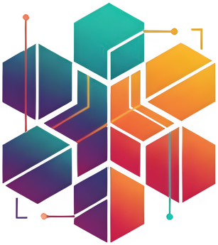

<p align="center">
  
</p>

<p align="center">
  <b>Search your notes by meaning.</b><br/>
  Search <i>happiness</i> → find notes on gratitude, morning routines, and weekend reflections.
</p>

<p align="center">
  <a href="https://github.com/oceanByte/obsidian-blue-notes/releases">
    <picture>
      <source media="(prefers-color-scheme: dark)" srcset="https://img.shields.io/github/v/release/oceanByte/obsidian-blue-notes?colorA=21262d&colorB=21262d&label=latest%20release&style=for-the-badge">
      
    </picture>
  </a>
  <a href="https://github.com/oceanByte/obsidian-blue-notes/blob/main/LICENSE">
    <picture>
      <source media="(prefers-color-scheme: dark)" srcset="https://img.shields.io/github/license/oceanByte/obsidian-blue-notes?colorA=21262d&colorB=21262d&style=for-the-badge">
      
    </picture>
  </a>
</p>

## Blue Notes

Blue Notes helps you search your notes by meaning, not just by words.
It connects ideas, finds patterns you might have missed, and makes your notes feel more alive and connected.

All semantic search happens locally on your computer, keeping your data safe and offline.
The optional AI chat feature uses your own API key and connects to the internet only when you choose to use it.

## Features

- 🔍 **Semantic Search** – Find notes by meaning, not just keywords
- 🔒 **Private & Offline** – Searching happens on your computer, no data leaves your device
- 🌍 **Multi-Language Support** – Works with 100+ languages out of the box
- ⚡ **Fast Results** – ONNX Runtime keeps semantic search fast on your device
- 📦 **Minimal Dependencies** – Lightweight footprint with minimal external dependencies
- 💬 **AI Chat (Optional)** – Ask questions about your notes using your own API key

## Getting Started

### Step 1: Installation & Setup
1. Open Obsidian Settings → Community Plugins → Browse
2. Install **"Blue Notes"** and enable it

The plugin automatically:
- Downloads ONNX Runtime binaries and AI embedding model
- Indexes your vault in the background
- Notifies you when ready

**First-time setup takes a few minutes.** The plugin downloads ONNX Runtime (the engine that powers local AI) and an embedding model to enable private, offline semantic search. After this one-time setup, everything runs locally on your device.

### Step 2: Start Searching
1. Open **Command Palette** (`Cmd/Ctrl + P`)
2. Run "**Semantic search**"
3. Type what you're looking for (by meaning, not exact words)

**Example:** Searching for "*happiness research*" will find notes about "*well-being studies*", "*positive psychology*", and "*life satisfaction*", even if those specific words aren't in your search.

### Step 3: Choose Your Model (Optional)

You can customize which AI model to use for semantic search.
Different models offer trade-offs between speed, language support, and accuracy.

Open Settings → Blue Notes → Model selection to choose one of the following:

- **Multilingual E5 Small (default)** - Efficient multilingual model supporting 100+ languages with excellent performance
- **all-MiniLM-L6-v2** - Small, fast, but English-only model (choose if performance matters more than accuracy)

## How to Use

| Command | Description |
|---------|-------------|
| **Semantic search** | Find notes by meaning across your entire vault |
| **Find related notes** | Show notes semantically related to your current file |
| **Process entire vault** | Index all notes (run once at setup, or after major changes) |
| **Process current file** | Update the index for just the current note |


### Optional: AI Chat
Want to ask questions about your notes?

1. Click the chat icon in the ribbon (or use Command Palette → "**Open AI chat**")
2. Add an **API key** in settings (e.g. OpenAI)
3. Select which notes to include as context
4. Ask questions like:
   - *"What are my main ideas about love?"*
   - *"Summarize everything I've written about postmodern philosophy"*
   - *"What connections exist between my work notes and personal goals?"*

⚠️ **Note:** Chat requires an internet connection and only sends the notes you explicitly select. Search remains fully private and offline.

## Privacy: What Happens to Your Notes?

### Local Semantic Search (Always Private)

- ✅ Runs 100% on your computer
- ✅ Works offline after initial setup
- ✅ Your notes **never leave your device**
- ✅ No tracking or data collection

**One-time download:** When you first use the plugin, it downloads ONNX Runtime binaries (~50-127MB depending on your platform) and a ~113MB AI model from HuggingFace. After that, everything is local.

### AI Chat (Optional Feature)

- ⚠️ Only works when you choose to use it
- ⚠️ Requires internet connection
- ⚠️ Only sends **notes you manually select** as context
- ⚠️ Uses **your own API key** (you control the provider)

**You're always in control.** The chat feature is completely optional and clearly separated from private search.

## Where Files Are Stored

Blue Notes stores all files within your vault:

```
.obsidian/plugins/blue-notes/
├── models/              # AI embedding models
├── cache/               # Search index
├── onnxruntime-node/    # ONNX Runtime binaries (auto-downloaded)
└── data.json            # User settings
```

All data stays local and can be safely deleted anytime.

## FAQ

| Question | Answer |
|----------|--------|
| **Is this really private?** | Yes. Semantic search runs 100% locally. AI chat only sends notes you explicitly choose, and only if you enable it. |
| **Do I need an API key?** | No. Semantic search works without any API key. You only need one for the optional chat feature. |
| **Does it work offline?** | Semantic search works offline. AI Chat needs internet. |
| **Does it work on mobile?** | No, desktop-only. |
| **Will it slow down Obsidian?** | Only during initial processing. After that, searches are very fast. |

## Troubleshooting

**ONNX Runtime installation failed**
- Check your internet connection
- Open Settings → Blue Notes → ONNX Runtime Status
- Click "Download ONNX Runtime" to retry the download
- Verify your firewall isn't blocking the download
- Check if you have enough disk space (50-127MB required)

**Search returns no results**
- Try running "Process entire vault" again
- Try different search terms or lower the threshold in settings

**Model won't download**
- Check your internet connection
- [Download the default model manually](https://huggingface.co/intfloat/multilingual-e5-small)
- [Download the all-MiniLM-L6-v2 model manually](https://huggingface.co/sentence-transformers/all-MiniLM-L6-v2)

**Plugin feels slow**
- Normal for first-time processing
- Faster computer = faster indexing

**AI chat not responding**
- Check your API key in settings
- Make sure you have internet connection
- Verify you've selected notes as context

## Advanced Users

## Build from Source
```bash
git clone https://github.com/oceanbyte/obsidian-blue-notes
cd obsidian-blue-notes
pnpm install
pnpm run build
```

### For Contributors

This project uses [changesets](https://github.com/changesets/changesets) for automated version management:
1. Make your code changes
2. Create a changeset: `pnpm changeset`
3. Commit the changeset file with your changes
4. Create a pull request

### For Maintainers

When a PR with changesets is merged to main:
1. GitHub Actions automatically creates a "Version Packages" PR
2. Review and merge the "Version Packages" PR
3. GitHub Actions automatically:
   - Creates a git tag
   - Builds the plugin
   - Creates a GitHub release with assets

## Get Help

- **Bug reports**: [GitHub Issues](https://github.com/oceanbyte/obsidian-blue-notes/issues)
- **Questions**: [GitHub Discussions](https://github.com/oceanbyte/obsidian-blue-notes/discussions)

## Credits

Built with [ONNX Runtime](https://onnxruntime.ai/) and ❤️ for [Obsidian](https://obsidian.md/)
